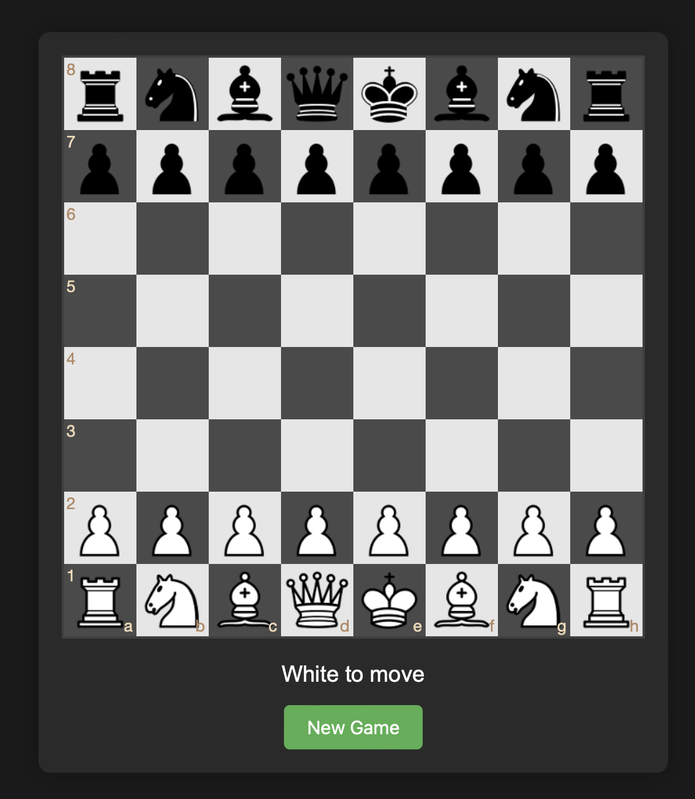

# 🎮 Minimalist Chess Game

<div align="center">


A proof of concept chess web application, which you can run locally, and play vs an AI.

[Play Now](#installation) · [Report Bug](https://github.com/jackbeardless/Chess/issues) · [Request Feature](https://github.com/jackbeardless/Chess/issues)



</div>

## ✨ Features

- 🌙 Elegant dark mode interface
- 🤖 Play against AI opponent
- ✅ Legal move validation
- 🎯 Intuitive drag-and-drop gameplay
- 🎭 Smart piece movement animations
- 📱 Responsive design for all devices

## 🚀 Quick Start

### Prerequisites

- A modern web browser
- That's it! No additional installations required

### Installation

1. Clone the repository   ```sh
   git clone https://github.com/yourusername/chess-game.git   ```
2. Navigate to the project directory   ```sh
   cd chess-game   ```
3. Open `index.html` in your browser
4. Start playing! You'll be white, playing against the AI

## 🎮 How to Play

1. The game starts automatically with you playing as White
2. Click and drag pieces to make your moves
3. The AI will respond automatically
4. Use the "New Game" button to reset at any time

## 🛠️ Built With

-  HTML5 for structure
-  CSS3 for styling
-  JavaScript for game logic
- [chess.js](https://github.com/jhlywa/chess.js) for chess move validation
- [chessboard.js](https://chessboardjs.com/) for board visualization

## 📋 Roadmap

- [ ] Add move sound effects
- [ ] Implement move history
- [ ] Add captured pieces display
- [ ] Include game timer
- [ ] Improve AI difficulty levels
- [ ] Add multiplayer support

## 🤝 Contributing

Contributions are what make the open source community such an amazing place to learn, inspire, and create. Any contributions you make are **greatly appreciated**.

1. Fork the Project
2. Create your Feature Branch (`git checkout -b feature/AmazingFeature`)
3. Commit your Changes (`git commit -m 'Add some AmazingFeature'`)
4. Push to the Branch (`git push origin feature/AmazingFeature`)
5. Open a Pull Request

## 📝 License

Distributed under the MIT License. See `LICENSE` for more information.

## 📧 Contact

Your Name - [@yourtwitter](https://twitter.com/yourtwitter) - email@example.com

Project Link: [https://github.com/yourusername/chess-game](https://github.com/yourusername/chess-game)

## 🙏 Acknowledgments

- [chess.js](https://github.com/jhlywa/chess.js)
- [chessboard.js](https://chessboardjs.com/)
- [jQuery](https://jquery.com)

---

<div align="center">
Made with ❤️ by [Your Name]
</div>
